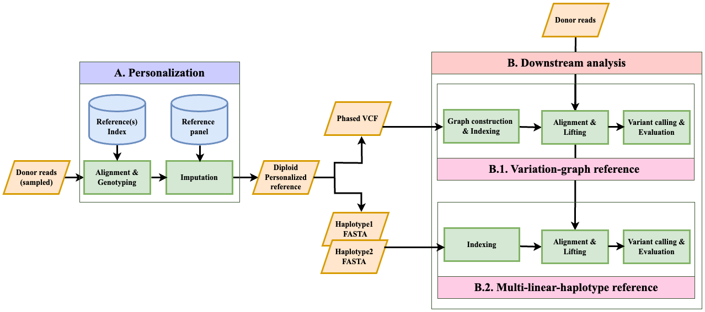

# Impute-First Alignment framework

## Introduction
The Impute-First alignment framework aims to minimize reference bias by creating personalized references. This method enhances variant-calling accuracy, precision, and efficiency in whole-genome DNA sequencing analysis.

## Workflow Overview
  
*Figure 1: The Impute-first alignment workflow*

## Repository Structure

- `imputefirst_workflows/upstream_personalization/`: Snakemake workflow to generate personalized diploid references from downsampled reads by performing genotyping and imputation using a reference panel.

- `preprocessing_upstream_pipelines/`: Workflow assessing different genotyping and imputation method combinations for generating personalized references.

- `imputefirst_workflows/downstream_analysis_with_giraffe/`: Downstream analysis using Impute-First personalized diploid references of a given sample, built into variation graphs, enabling alignment and lift-over with VG Giraffe (Figure 1, Section B.1) and to perform variant calling.

- `imputefirst_workflows/downstream_analysis_with_leviosam2/`: Downstream analysis using Impute-First personalized diploid FASTA references of a given sample, aligned with BWA-MEM and lifted with LevioSAM2 to perform variant calling (Figure 1, Section B.2).

- `benchmarking_downstream_workflows/`: Scripts to generate GRCh38-aligned BAMs for benchmarking Impute-First personalized diploid references against linear, pangenome, personalized-pangenome, and ground-truth reference combinations for a given sample. 

- `evaluation/`: Scripts for computing evaluation metrics:
  - Genotyping and Imputation Calls evaluation: Call Accuracy, Window Accuracy.
  - Downstream analysis evaluation: Allelic Balance at HETs, Variant Call Accuracy.

## Running the Upstream Personalization Workflow

The upstream personalization workflow is implemented using Snakemake and defined in `upstream_personalization/`. It performs read downsampling, genotyping, and imputation to generate diploid personalized reference for a given sample.

All required software dependencies are listed in the Conda environment file `env.yml`. A compatible environment can be created with:

```bash
conda env create -f imputefirst_workflows/upstream_personalization/env.yml
conda activate genotyping_imputation
```

To test the workflow, a chromosome 21–based demonstration is provided in the `upstream_personalization/` directory. It includes the following files:
- `download_exampleData.sh`: Downloads a small test dataset (HG002 chr21 reads and reference files).
- `download_linkage_maps.sh`: Downloads linkage maps for use with Beagle and GLIMPSE.
- `configs/exampleData_config.yaml`: Configuration file for running the workflow on the example dataset.

Run the workflow with:
```bash
snakemake -j <threads> --configfile configs/exampleData_config.yaml
```

This config file parameters can be modified to enable using different input files.  

Dependencies and setup instructions for downstream and benchmarking modules are described in their respective subdirectories.

## Running the Downstream Analysis Workflow
[LevioSAM2 based workflow](imputefirst_workflows/downstream_analysis_with_leviosam2/)

[VG giraffe based workflow](imputefirst_workflows/downstream_analysis_with_giraffe/)

## Getting Started

1. Clone the repository to your local machine.
2. Navigate to each module's directory and follow the instructions in the `README.md` files to execute the scripts.

## Contact

For inquiries or support related to the Impute-First alignment framework, please reach out to us.  
- Naga Sai Kavya Vaddadi - kvaddad1@jhu.edu  
- Ben Langmead - langmea@cs.jhu.edu  

Johns Hopkins University, Department of Computer Science

## Acknowledgments

This work was generously supported by NIH Grant R01HG011392. Special thanks to Langmead lab colleagues.

## Available Resources 
[preprint](https://www.biorxiv.org/content/10.1101/2023.11.30.568362v1): Vaddadi, Naga Sai Kavya, Taher Mun, and Ben Langmead. "Minimizing Reference Bias with an Impute-First Approach." bioRxiv (2023): 2023-11.

[abstract](https://dl.acm.org/doi/abs/10.1145/3584371.3613034): Vaddadi, Naga Sai Kavya, Taher Mun, and Benjamin Langmead. "Minimizing Reference Bias: The Impute-First Approach for Personalized Genome Analysis." Proceedings of the 14th ACM International Conference on Bioinformatics, Computational Biology, and Health Informatics. 2023.

[CSHL Genome Informatics Talk 2023](https://meetings.cshl.edu/abstracts.aspx?meet=INFO&year=23), [Slides](https://docs.google.com/presentation/d/1SGVYc76DjTdOU9Cp6WVBcPAf-iFE27wV/edit?usp=sharing&ouid=107230113542653466951&rtpof=true&sd=true): Minimizing reference bias with an impute-first approach.

