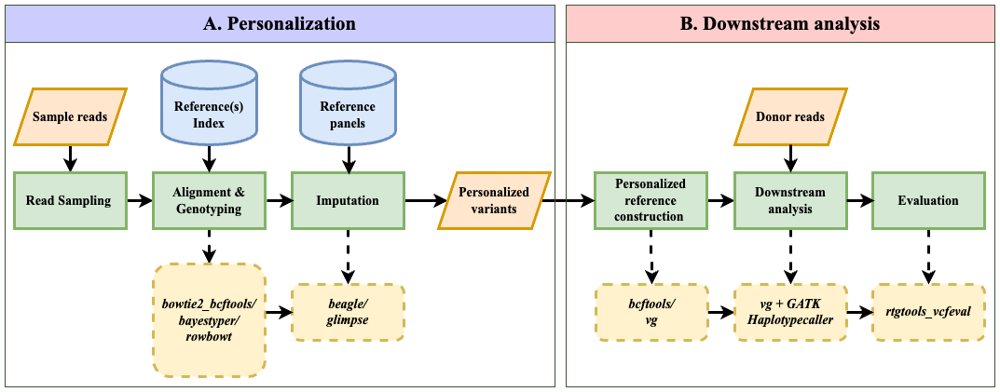

# Impute-First Alignment framework

## Introduction
The Impute-First alignment framework aims to minimize reference bias by creating personalized references. This method enhances variant-calling accuracy, precision, and efficiency in whole-genome DNA sequencing experiments/analysis.

## Workflow Overview

*Figure 1: The Impute-first alignment workflow*

## Repository Structure

- `preprocessing/`: Combines read sampling, alignment, and rough genotyping into a snakemake workflow.
- `imputation/`: Scripts for genotype imputation using Beagle and GLIMPSE.
- `reference_construction/`: Workflows for constructing diploid and VG graph references, including their indexing.
- `downstream_analysis/`: Scripts for VG Giraffe mapping, diploid mapping, and GATK HaplotypeCaller analysis.
- `evaluation/`: Evaluation scripts for assessing the performance of the personalized references and downstream analysis.

Each module contains a `README.md` file with detailed information about the scripts, their function, and instructions for execution.

## Software Requirements

To run the Impute-First alignment framework, the following tools and versions are required:

- [seqtk](https://github.com/lh3/seqtk) 
- [Bowtie 2 v2.4.2](http://bowtie-bio.sourceforge.net/bowtie2/index.shtml) 
- [bcftools v1.13](https://samtools.github.io/bcftools/) 
- [bwa v0.7.17](https://github.com/lh3/bwa/releases)
- [Bayestyper v1.5](https://github.com/bioinformatics-centre/BayesTyper) 
- [kmc v3.2.1](https://github.com/refresh-bio/KMC/releases)
- [rowbowt](https://github.com/alshai/rowbowt)
- [beagle v5.1](https://faculty.washington.edu/browning/beagle/beagle.html) 
- [glimpse v1.0.0](https://odelaneau.github.io/GLIMPSE/) 
- [vg autoindex and vg giraffe v1.46.0](https://github.com/vgteam/vg/releases) 
- [GATK v4.2.6.1](https://github.com/broadinstitute/gatk/releases)
- [rtgtools v3.12.1](https://github.com/RealTimeGenomics/rtg-tools/releases) 
- [biastools](https://github.com/maojanlin/biastools)
- [snakemake v6.1.0](https://snakemake.readthedocs.io/en/v6.1.0/getting_started/installation.html)

Please ensure that all dependencies are installed and properly configured before executing the workflow scripts.

## Getting Started

1. Clone the repository to your local machine.
2. Navigate to each module's directory and follow the instructions in the `README.md` files to execute the scripts.
3. Install all the necessary tools listed in the Software Requirements section.

## Contact

For inquiries or support related to the Impute-First alignment framework, please reach out to us. 
- Naga Sai Kavya Vaddadi - kvaddad1@jhu.edu
- Ben Langmead - langmea@cs.jhu.edu

Johns Hopkins University, Department of Computer Science

## Acknowledgments

This work was generously supported by NIH Grant R01HG011392. Special thanks to Langmead lab colleagues.

## Citation

For academic use, please cite our work as follows:

Vaddadi, N.S.K., Mun, T., Langmead, B. (2023). Minimizing Reference Bias with an Impute-First Approach. Johns Hopkins University.
