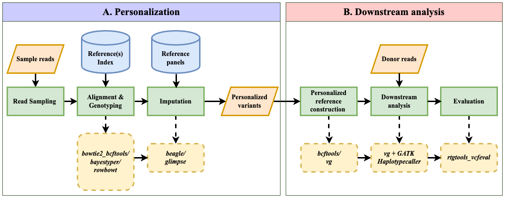

## Context
This module is the benchmarking component as described in the [rowbowt paper](https://pubmed.ncbi.nlm.nih.gov/36409181/). 

This serves as a supporting component developed to explore and evaluate various genotyping and imputation method combinations. 
It includes scripts for generating genotyping calls for `rowbowt`, `bayestyper`, and `bowtie2+bcftools`, and an `imputation/` folder containing scripts for running imputation using `Beagle` and `GLIMPSE`. This workflow utilizes HG001 read data and HGSVC2 reference panel.  
It was primarily used for benchmarking and preprocessing in preliminary analyses to assess their potential integration into the Impute-first Alignment framework.

- [Preprint](https://www.biorxiv.org/content/10.1101/2023.11.30.568362v1): Vaddadi, Naga Sai Kavya, Taher Mun, and Ben Langmead. "Minimizing Reference Bias with an Impute-First Approach." bioRxiv (2023): 2023-11.
- [Abstract](https://dl.acm.org/doi/abs/10.1145/3584371.3613034): Vaddadi, Naga Sai Kavya, Taher Mun, and Benjamin Langmead. "Minimizing Reference Bias: The Impute-First Approach for Personalized Genome Analysis." Proceedings of the 14th ACM International Conference on Bioinformatics, Computational Biology, and Health Informatics. 2023.
- [CSHL Genome Informatics Talk 2023](https://meetings.cshl.edu/abstracts.aspx?meet=INFO&year=23)
- [Slides](https://docs.google.com/presentation/d/1SGVYc76DjTdOU9Cp6WVBcPAf-iFE27wV/edit?usp=sharing&ouid=107230113542653466951&rtpof=true&sd=true)

## Workflow Overview
  
*Figure 1: The Impute-first alignment preprocessing workflow*

## Installation
1) download and install [rowbowt](https://github.com/alshai/rowbowt) somewhere (please use the `dev` branch!)

```
git clone --recursive git@github.com:alshai/rowbowt.git .
cd rowbowt
git checkout dev
mkdir build
cd build
cmake .. -DCMAKE_INSTALL_DIRECTORY=<install dir>
cmake --build . && cmake --install .
export PATH=<install dir>:$PATH # optional, if <install dir> not already in PATH
```

2) clone this repo:

```git clone --recursive git@github.com:alshai/impute_first.git```

3) in your config file, modify `pfbwt_bins` and `rowbowt_bins` to point to their respective executable paths

4) modify the other parts of the config file accordingly

5) the Snakemake should handle most of the other files and executables needed

## File structure:

1) `Snakemake` - the "main" Snakemake file. contains common utility rules

2) `rowbowt.snk` - contains rules used to build rowbowt index

3) `marker_benchmark.snk` - contains rules used for benchmarking other tools (bowtie2_bcftools, bayestyper)

4) `configs/*.yaml` - an assortment of configurations for running the workflow.

    - ex. `configs/hg38.hsvc.yaml` is the config for building a rowbowt index using the variants provided by HSVC (SVs + short variants).

    - modify accordingly to suit your input reads/reference files. 

## Usage
Modify `rule all` in `Snakefile` to produce different results:

```
rule all:
    input:
        """ FNAME """
```

possible  substitutes for FNAME:
- `ROWBOWT_FNAME` - builds the rowbowt index on yaml file based data files 

Then, run (in this directory):
```
snakemake -j<nthreads> --configfile <your configfile> 
```
